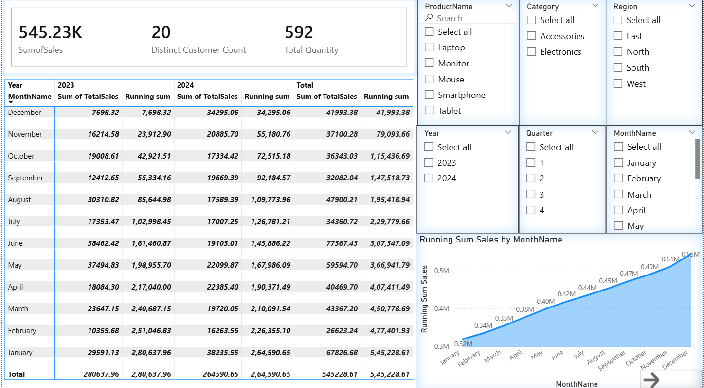
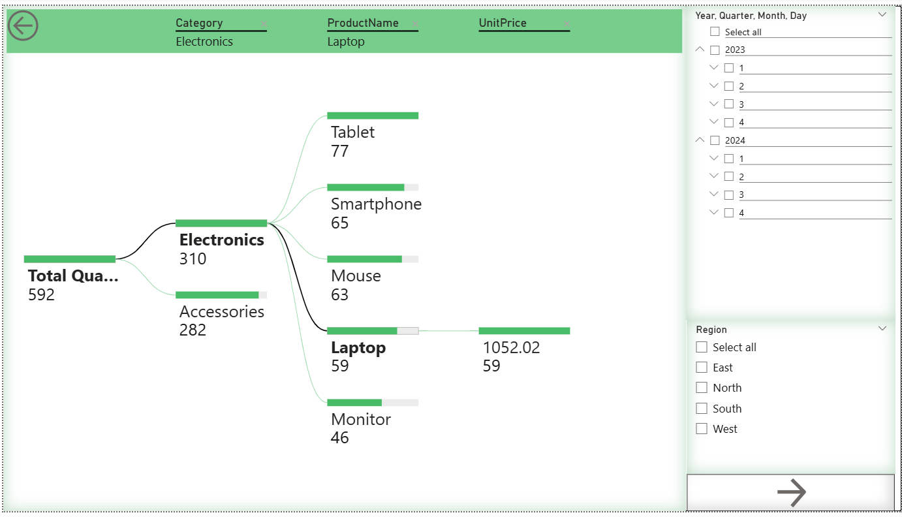
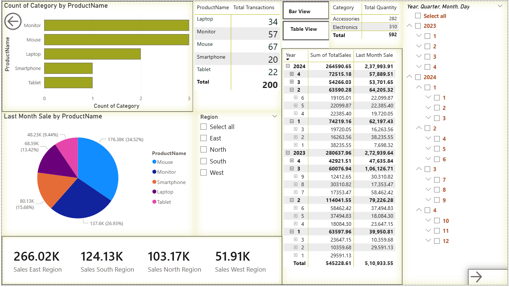
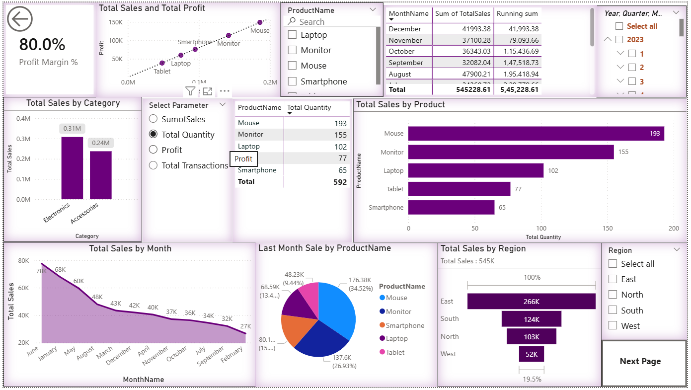
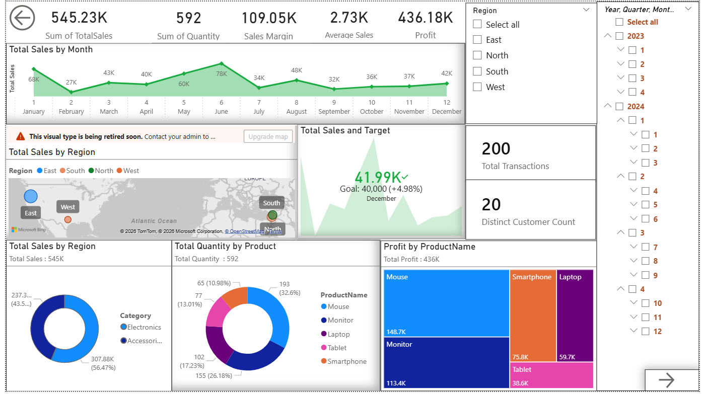
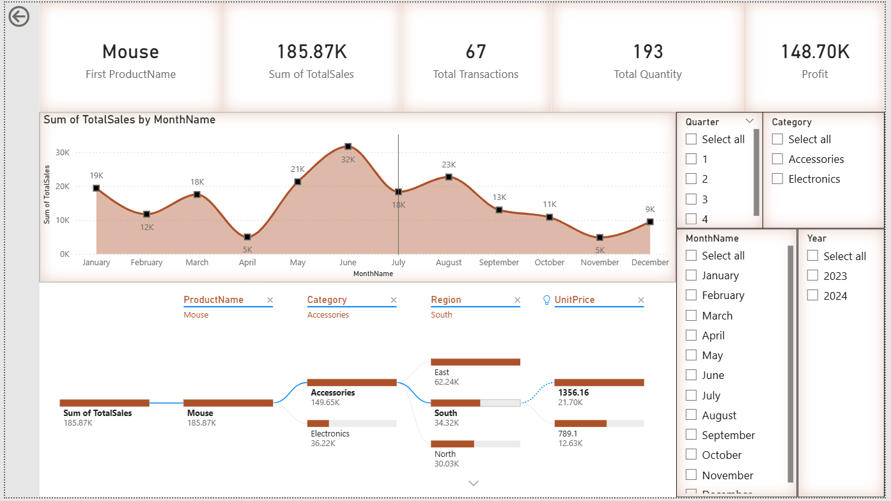
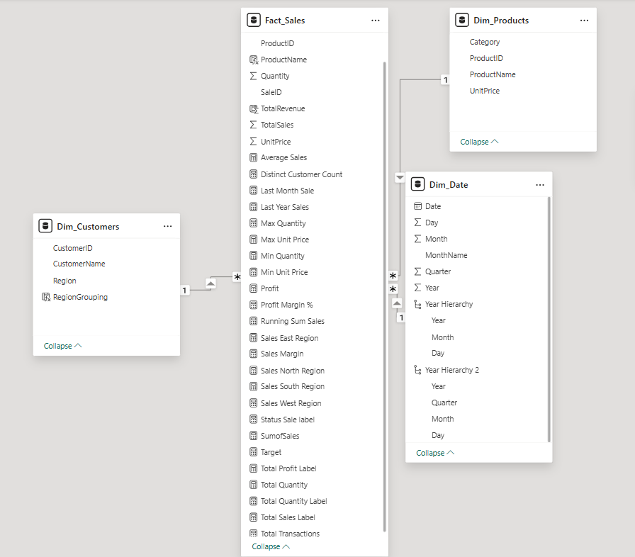

# 📊 Power BI Sales Data Report - Comprehensive Documentation

## 🚀 1. Project Overview

This project is an advanced Power BI analytical suite designed to provide stakeholders with a 360-degree view of sales performance, profitability, and operational efficiency. By transforming raw transactional data from Excel into interactive visuals, this report enables users to identify high-performing products, seasonal trends, and regional growth opportunities. The report is built upon a robust Star Schema architecture to ensure high performance and accurate data relationships.

### ❓ The Challenge (Problem Statement)

Business owners often have thousands of rows of sales data in Excel but find it hard to see the "Big Picture." It is difficult to manually track which regions are growing, which products are losing money, and whether monthly targets are being met. This report was built to solve these problems by making data easy to see, filter, and understand in seconds.

---

## 🎬 2. Interactive Demonstrations

The following recordings demonstrate the dynamic interactivity of each report page. Notice how the visuals react instantly to slicer selections and cross-filtering.

### 1. Running Sales Trend Analysis


### 2. Physical Quantity Decomposition Analysis


### 3. Product Performance & Transaction Metrics


### 4. Comprehensive Profitability Overview


### 5. Executive KPI & Target Achievement Tracking


### 6. Granular Product Drill-Through


---

## 🖼️ 3. Visual Gallery

<details>
<summary>Click here to expand the high-resolution screenshot gallery</summary>

### Page 1 Snapshot



### Page 2 Snapshot



### Page 3 Snapshot



### Page 4 Snapshot



### Page 5 Snapshot



### Page 6 Snapshot



</details>

---

## 📁 4. Project Directory Structure

Below is the organized directory layout for the assets and documentation included in this repository.

```text
PowerBI-Sales-Data-Report/
├── assets/
│   ├── screen-recordings/      # Video demonstrations of every report page
│   └── screeenshots/           # Static high-resolution snapshots and schema
├── data/
│   └── Sales_Raw_Data.xlsx     # The primary dataset used for the data model
├── documentation/
│   ├── DAX-Measures.md         # Detailed logic for every calculation
│   └── pages-description-markdown-files/  # Detailed focus docs for all 6 pages
├── PowerBI-report-and-template/
│   ├── Sales-Data-Report-Template-PowerBI.pbit  # The lightweight template file
│   └── Sales-Data-Report-PowerBI.pbix           # The main Power BI Desktop file
└── README.md                   # Project master documentation
```

---

## 🏗️ 5. Technical Architecture (Data Model)

The report is designed using a **Star Schema** for optimal performance. The `Fact_Sales` table is at the center, surrounded by four dimension tables.


- **Fact_Sales**: Contains numerical records of every transaction (Sales, Quantity, Price). Key links: `SaleID`, `ProductID`, `CustomerID`, `Date`.
- **Dim_Customers**: Contains customer names and geographic `Region`.
- **Dim_Products**: Contains names and hierarchal `Category`.
- **Dim_Date**: A dedicated calendar table for advanced time intelligence (Year, Month, Quarter).

---

## 📋 6. Report Component Summary

Before diving into the detailed analysis, here is a high-level summary of the report's structure and primary objectives.

| Page Name                  | Primary Goal                  | Key Visual Component      |
| :------------------------- | :---------------------------- | :------------------------ |
| **Running Sales Trend**    | Visualize cumulative growth   | Running Sum Area Chart    |
| **Quantity Decomposition** | Root-cause analysis of volume | Decomposition Tree (AI)   |
| **Product Performance**    | Identify top/bottom sellers   | Last Month Sale Pie Chart |
| **Profitability Overview** | Balance revenue vs. margin    | Sales/Profit Scatter Plot |
| **KPI & Target Tracking**  | Monitor goal achievement      | Goal Gauge & Status Map   |
| **Product Drill-Through**  | Isolated item investigation   | Dynamic Product Isolator  |

---

## 🔍 7. Extensive Page-by-Page Analysis

### Page 1: Running Sales Trend Analysis

This page focuses on the cumulative growth of sales over time.

- **KPI Cards (Top):**
  - **Sum of Sales:** Displays the total revenue generated. _Insight: Instant view of total scale._
  - **Distinct Customer Count:** Shows how many unique people bought items. _Insight: Helps measure customer reach._
  - **Total Quantity:** Total count of individual items sold.
- **Comparison Matrix (Center):**
  - **Visual:** A grid showing Year (2023 vs 2024) across the top and Month Name down the side.
  - **Function:** Compares "Sum of Sales" vs "Running Sum" side-by-side. _Insight: You can see exactly when 2024 started beating 2023._
- **Running Sum Area Chart (Bottom):**
  - **Visual:** A shaded area chart showing a continuous blue line.
  - **Insight:** Visually confirms that sales are "piling up" steadily. It provides a quick way to see the slope of growth.
- **Global Slicers:** Six filters including Region and Product allow you to customize the entire trend for a specific sub-section of the market.

### Page 2: Quantity Decomposition Analysis

This page uses modern AI visuals to find the root causes behind quantity numbers.

- **Decomposition Tree:**
  - **Visual:** A branching chart that starts with "Total Quantity".
  - **Drill Path:** Users can click the "+" to see the split by Category, then Product Name, and finally Unit Price.
  - **Insight:** This answers "Why is our quantity 592?". It shows that most items belong to "Electronics" and specifically the "Mouse" product.
- **Date Hierarchy Slicer:** A vertical checklist that allows drilling from Year down to specific Days.

### Page 3: Product Performance & Transactions

This page isolates product-level success and regional dominance.

- **Regional KPI Cards (Bottom):**
  - **Visual:** Four distinct labels for East, South, North, and West.
  - **Insight:** Identifies which geographic area is the most profitable without needing to open a menu. (East is the clear leader).
- **Last Month Sale Pie Chart:**
  - **Function:** Displays the sales makeup for only the previous month.
  - **Insight:** Identifies "Trending" products during the most recent business cycle.
- **Transaction vs Quantity Matrix:**
  - **Visual:** Table comparing current sales to "Last Month Sale".
  - **Insight:** Calculates growth percentage implicitly by showing the difference between the two periods.

### Page 4: Profitability Overview

This page provides a deep look at financial health and margins.

- **Sales & Profit Scatter Plot:**
  - **X-Axis:** Total Sales | **Y-Axis:** Profit.
  - **Function:** Places every product as a dot on the graph.
  - **Insight:** Dots in the top-right corner are high-revenue and high-profit. Dots in the bottom-left are low-performing items.
- **Metric Parameter Picker:**
  - **Benefit:** Allows the user to change the entire page from "Sales" to "Profit" or "Transactions" using simple radio buttons. _This saves huge amounts of screen space._
- **Funnel Chart:** Displays regional sales. The wider the funnel, the larger the sales volume.
- **80.0% Profit Margin Card:** A static/dynamic label showing the company's efficiency in keeping revenue.

### Page 5: Executive KPI & Target Tracking

This is a summary page for senior management to check against goals.

- **Target Goal Gauge:**
  - **Goal:** 40,000 units/dollars.
  - **State:** Displays a green checkmark if the target is exceeded.
  - **Insight:** Provides a "Success vs Failure" metric for the current period.
- **Geographic Map:**
  - **Visual:** Bubbles placed on a world/regional map.
  - **Insight:** Visually connects sales volume to physical areas. Larger bubbles mean more money.
- **Management Cards:** Five labels at the top showing Sales Margin, Average Sale price, and Total Profit.

### Page 6: Product Drill-Through

Designed for deep investigation of a single item.

- **Product Isolator:** A text card that dynamically changes its name to match whatever product you are looking at (e.g., "Mouse").
- **Specific Trend Line:** Shows only the sales mountain for that one product.
- **Detailed Breakdown Path:** A decomposition tree specifically tuned to find which regions buy this specific product the most at what price point.

---

## 🔢 8. Advanced DAX Calculations & Functions

In this project, I used complex DAX formulas to provide insights that simple dragging-and-dropping cannot provide. Below is a detailed breakdown of the functions used.

### A. Time Intelligence (Comparing Time Periods)

These measures allow the business to understand growth over months and years.

- **Last Month Sale**

  ```dax
  Last Month Sale = CALCULATE([SumofSales], DATEADD(Dim_Date[Date], -1, MONTH))
  ```

  - **Functions Used:** `CALCULATE` (Changes the focus of the math), `DATEADD` (Moves the calendar back in time).
  - **Purpose:** Compares today's sales to exactly one month ago.

- **Running Sum Sales**
  ```dax
  Running Sum Sales = CALCULATE([SumofSales], FILTER(ALLSELECTED('Dim_Date'), 'Dim_Date'[Date] <= MAX('Dim_Date'[Date])))
  ```

  - **Functions Used:** `FILTER` (Restricts data), `ALLSELECTED` (Ignores filters on the chart but keeps filters from slicers), `MAX` (Finds the current month in view).
  - **Purpose:** Creates a cumulative total that grows month-by-month.

### B. Profitability & Business Logic

These measures calculate how much money we keep after costs.

- **Profit (80% Margin Logic)**

  ```dax
  Profit = SUM(Fact_Sales[TotalSales]) * (0.8)
  ```

  - **Logic:** Assumes that 80% of every sale is actual profit (modeled).

- **Sales Margin (Using Variables for Efficiency)**
  ```dax
  Sales Margin =
  VAR Cost = (0.8) * [SumofSales]
  VAR Revenue = [SumofSales]
  VAR SalesMargin = Revenue - Cost
  RETURN SalesMargin
  ```

  - **Logic:** Uses `VAR` (Variables) to store numbers temporarily. This makes the code faster and much easier for a human to read.

### C. Regional & Filtering Measures

These force the data to look only at one specific area.

- **Regional Sales (Example: East)**
  ```dax
  Sales East Region = CALCULATE(SUM(Fact_Sales[TotalSales]), Dim_Customers[Region]="East")
  ```

  - **Logic:** Tells Power BI: "Sum up the sales, but ONLY if the customer is from the East region."

### D. Dynamic Labels (String Concatenation)

Used to make the report look professional and readable.

- **Total Sales Label**
  ```dax
  Total Sales Label =
  VAR total_sales = SUM(Fact_Sales[TotalSales])
  VAR total_sales_label = "Total Sales : " & FORMAT(total_sales, "#,##0,K")
  RETURN total_sales_label
  ```

  - **Functions Used:** `FORMAT` (Changes numbers into text with commas), `&` (Connects words together).
  - **Purpose:** Combines the word "Total Sales" with the actual currency number so it fits perfectly on a decorative card.

### E. Dynamic Field Parameters

These allow the user to change what a chart is measuring without me building multiple charts.

- **Select Parameter:** Uses the `NAMEOF` function to grab the identities of other measures (like Profit or Quantity) and put them into a checklist for the user.

---

## 💡 9. Power BI Template Information (.pbit)

To keep this repository lightweight and professional, a **Power BI Template (.pbit)** file can be utilized.

### What is a .pbit file?

A Power BI Template contains the **entire structure** of the report (data model, relationships, DAX measures, and visual designs) but does **not include the actual data**. This makes the file size significantly smaller and easier to share on platforms like GitHub.

### How it Helps:

- **Security**: You can share your stunning designs without sharing sensitive or private data.
- **Portability**: It allows other developers to import your "blueprint" and connect it to their own data sources (like SQL or different Excel files) seamlessly.

### How to use/generate it:

1.  In Power BI Desktop, go to **File > Export > Power BI Template**.
2.  **Description Prompt**: When prompted for a description, you should write:
    > "Standardized Sales Performance Blueprint. Features a Star Schema architecture, 25+ advanced DAX measures (Time Intelligence, Profitability), and a 6-page interactive UI. Optimized for cross-region retail analysis."

### 🛠️ Troubleshooting: Data Source Error

If you see an error when opening the `.pbit` file, it is because the file path to the Excel data has changed. To fix this:

1.  Click **"Transform Data"** in the top ribbon.
2.  Go to **"Data Source Settings"**.
3.  Select the Excel file and click **"Change Source"**.
4.  Browse and select your local `data/Sales_Raw_Data.xlsx` file.
5.  Click **"Close & Apply"**. All visuals will now populate!

---

## 📩 10. Contact & Contribution

If you have questions about the data model or DAX logic, feel free to reach out through the channels below.

<p align="center">
  <a href="https://github.com/Tanish-30-08-2006">
    
  </a>
  &nbsp;&nbsp;&nbsp;
  <a href="mailto:tanishsanghavi2@gmail.com">
    
  </a>
</p>

---

_Created for the Power BI Sales Reporting Suite. Documented to provide deep clarity on visuals, data relationships, and technical DAX execution._
